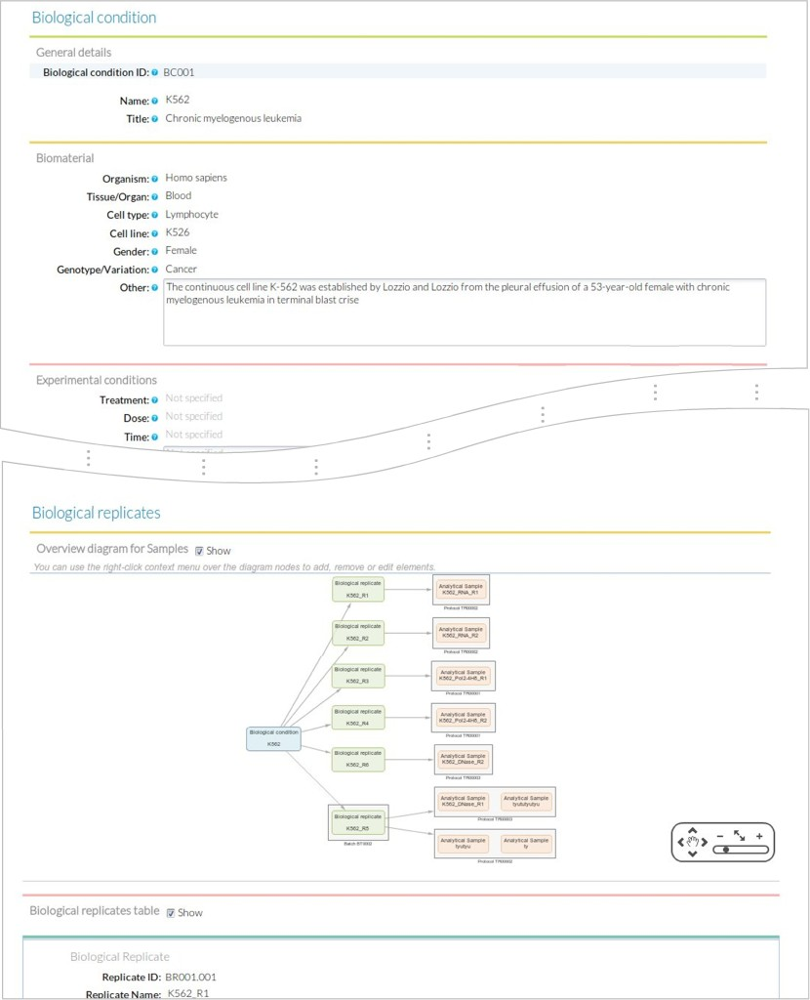

    

#What is the STATegra EMS?

High-throughput sequencing and NGS-based assays have become popular to study different levels of genome organization. The decreasing costs and widespread availability of sequencing and the little or not a priori genome knowledge required, have put the technology within reach of most laboratories, which can now use one or more NGS assays in their research projects. However, while the number of samples and replicates in these experiments are relatively modest, these can quickly grow to several dozens of files and thus require standardized annotation, storage and management of preprocessing steps.

As a part of the STATegra project, we have developed an Experiment Management System (EMS) for omics experiments that supports different types of sequencing-based assays, proteomics and metabolomics data. We specifically support experiments such as RNA-seq, miRNA-seq, Chip-seq, Methyl-seq, or DNase-seq and can easily be extended to support additional sequencing assays. The system has been developed to provide research laboratories with an integrated system that offers a simple and effective way for experiment annotation and tracking of analysis pipelines from raw data to ready-to-use measurements, using free, open source software technologies.

## Annotate your experiments

The STATegra EMS is an experiment oriented management system designed for storage and annotation of complex NGS and omics experiments.
In contrast to other solutions that put the focus on sample management, the STATegra EMS has its primary goal in the annotation of experiments designed and run at research laboratories, providing an easy-to-use tool for the annotation of experimental design, samples, measurements and the analysis pipelines for different analytical platforms and sequencing services.

    
    
Experiments, analysis and samples are widely related in bioinformatics. The STATegra EMS allows the annotation of experimental design, samples, measurements and the analysis pipelines for different analytical platforms and sequencing services.

    
    
Annotation details at Experiment module.

## Sample annotation

Keep your information about samples organized and centralized. Collect all the information about the used biomaterial of your experiments: biological material description, experimental conditions, batch processed, biological replicate.

    
    
Sample form. The sample form provides fields to annotate biological condition details including data on the associated biological replicates and analytical samples.

## Analysis annotation

### Wide range of pipeline steps

The STATegra LIMS supports annotation forms for mRNA-seq, ChIP-seq, DNase-seq, Methyl-seq, miRNA-seq, Proteomics and Metabolomics and can be easily adapted to other high-throughput experiments.

    
    
STATegra EMS analysis workflow components. The workflow is linked to an analytical sample object and consists of raw, intermediate and processed data IUs.

### Visual pipelines

Annotate all the analysis pipelines performed during your experiments using user –friendly interfaces with visual pipelines.

    
    
Analysis module input window.

