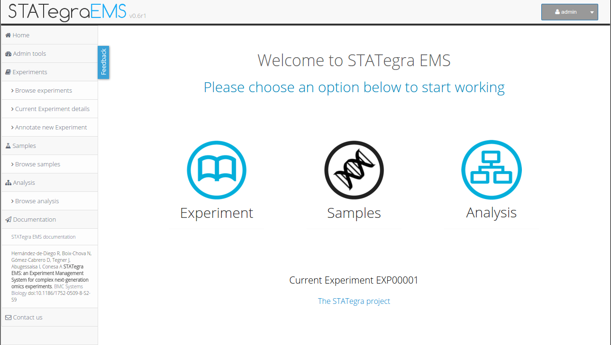
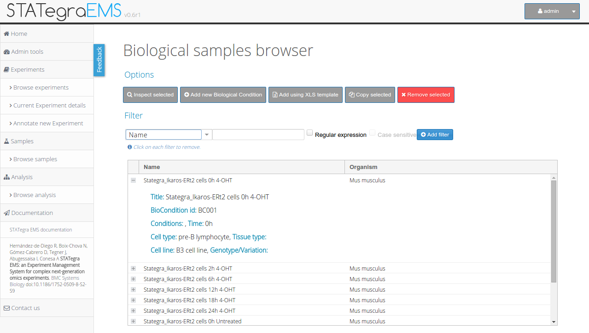
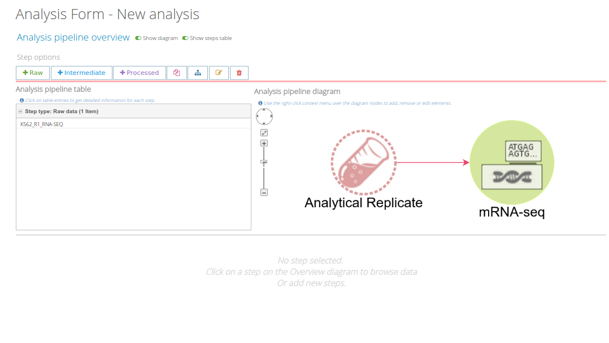
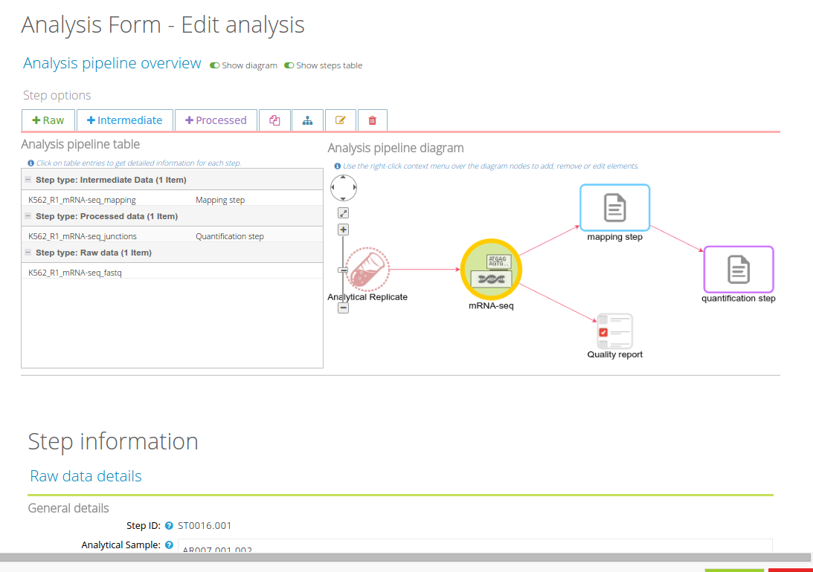

    

# STATegra EMS: Tutorial and Use Case

The following sections contain a brief use case in which we will note a study composed by mRNA-seq, DNase-seq and metabolomics experiments performed over a set of samples obtained by time series (batches).

## Use case video

## Web Application: general features

### The home page

The main page of the STATegra EMS application contains the main menu from which are accessible much of system options, such as registration of samples, analysis annotation, options for querying the information already recorded, etc. This menu is divided in 3 sections, depending on the nature of the information:  Experiments, samples and Analysis.

    

### The account menu

At the top right of the screen you will find a small menu with information about the user account. This menu offers different tools for account management (e.g. password changes) as well as the logout option.

    

### Use case
As pointed previously the information about samples is grouped by the biological conditions under they were grown or extracted, so that the process of annotation begins with the recording of samples.

To illustrate the usage and functionalities of the STATegra EMS, we consider the registration into the system of a subset of the ENCODE human dataset comprising the four omics data types (mRNA-seq, ChIP-seq, DNase-seq and Proteomics) of two cell lines GM12878 and K562, with two biological replicates for most data types. ENCODE cell lines were regularly cultured in batches at data production labs to generate the samples for the different sequencing assays. In our example, we consider the utilization of one or several biological replicates from the same batch to obtain the analytical samples for ChIP-seq and proteomics experiments as depicted in Figure 3. An instance of the STATegra EMS with the ENCODE test data fully annotated into the system can be accessed at [http://bioinfo.cipf.es/stategraems_test](http://bioinfo.cipf.es/stategraems_test).

    

#### Experiment annotation
The Experiment annotation starts by adding a new Experiment into the system. At the Home page click on the option Experiment and choose Experiment browse.

    

This option shows a new panel listing all the already annotated Experiments. From this panel users can inspect or edit the experimental design for Experiments\*, switch to other Experiments for annotation of new information\*\* (Samples and Analysis) or register new Experiments.   
*\*Only users registered as owner of a specific experiment can edit its information.*  
*\*\*Only users registered as owners or members can switch a specific experiment.*

    

At the Experiment Module a new experiment is created by the Experiment owner who assigns registered users to it. The Experiment has a unique ID within the system along with some basic information such as goal, description, type of experiment, experimental design and planned omics measurement types. Check boxes next to each planned measurement are available to monitor the progress of the experiment. These are automatically checked when a matching Analysis is uploaded and assigned to the Experiment. Figure 4c shows the Experiment annotation for our use case: a human-readable name (ENCODE test) and description (STATegra EMS test experiment) are given for the experiment, and the basic experimental details are indicated: *multiple conditions* experiment type, *two biological replicates* and 4 omics types,* mRNA-seq, ChIP-seq, DNase-seq and proteomics*.

    

#### Sample annotation
After the Analysis annotation we can continue with the Sample annotation so at *Home panel* choose the option *Browse Samples*. This option will show a list of all the annotated samples in the system, grouped by Biological condition. From this panel users can inspect, edit and annotate sample information.

The STATegra EMS offers 2 ways for Samples annotation: manually, filling out the appropriate forms, or by using XLS files provided by the application. In this tutorial we will show how to record samples manually, for more information about using templates see *STATegraEms: Other examples – Using templates for samples annotation*. 

    

Users then fill the Sample Module input form (Figure 5b). The first of four sections of this form includes fields for General information on the sample such as sample ID (auto_generated), sample name (K562 or GM12878) and title, which is a more extended description of the sample (Chronic myelogenous leukemia / Lymphoblastoid). The second section of the form is used to describe the Biomaterial. For this use case, we entered the lymphocyte cell type from the blood tissue in human, with GM12878 as normal and K562 as cancer variation. The Experimental condition section is left blank in this example, since our cell lines did not receive any particular treatment. The next section records the associated Biological Replicates, where we can add items when more than one biological replicate is available for the same biological condition. For this user case, we created nine biological replicates to implement the scheme in Figure 6 and indicated the number for each replicate (i.e. #1), the corresponding batch when applicable, and its derived analytical samples. Analytical samples are characterized by an extraction protocol and a name. Multiple analytical replicates can be created for one biological replicate. For example, the RNA-seq data in our use case has one Analytical sample per each of the two biological replicates obtained with the Caltech long mRNA extraction protocol, while the proteomics data includes four analytical samples corresponding to each sub-cellular fraction (membrane fraction, cytosol, nucleus, mitochondria) (Figure 3).

    

#### Analysis annotation
Finally, information about the processing workflows is incorporated in the **Analysis module**. While the use case involves four omics types, we will only describe the RNA-seq workflow in detail, as the Chip-seq, DNase and Proteomics workflows are conceptually similar.

First choose the *Browse Analysis* option at the home panel. This option shows a new panel containing all the Analysis anotated for the active experiment displaying a pipeline overview as well as a table summarizing all the steps in the workflow.

    

We can also browse Analysis by steps, using the provided tools to query and filter the information.

    

Within the active experiment, a new Analysis is selected, indicating mRNA-seq as the analysis type.

    

Clicking on the “Annotate new step” adds each new analysis step.

    

At the beginning of an Analysis “Raw Data” is the only option available, which opens the Raw Data form. At this point the user selects an existing Analytical Sample ID to start annotating the library preparation details and sequencing characteristics of a particular sample. In our example, we would choose the Analytical Sample #1 corresponding to Biological Replicate #1 of the K562 cell line. Additionally we can indicate the location of the raw data fastq file in our system. In principle the EMS does not stores any raw or processed data files, and instead provides pointers to the location of these files.

    

Once the Raw Data form is completed and saved, a graphical representation of the analysis workflow is created on the lower screen window of the Analysis Module.

    

This workflow will grow with the subsequent analysis steps. After the Raw Data step is created, additional intermediate steps can be added. In our user case, the next intermediate step to add is the mapping of the reads to the human reference genome, where the user would indicate which raw data file was used and other parameters such a reference genome annotation file or mapping algorithm such as GENCODE hg19 and TopHat respectively. Other subsequent intermediate steps can be envisioned such as trimming, removal of duplicate reads, etc. The analysis workflow ends with a Processed Data step with a form that requires annotation of a previous intermediate or raw data steps. For RNA-seq, one Processed Data step could for example correspond to the Cufflinks gtf file with FPKMs. A completed Analysis can be partially reused and modified to create additional workflows such as one leading to a different Processed Data step. For example, the first two steps of the previous analysis workflow can be imported to create a new workflow having a different Processed Data step recording a junction’s bed file obtained by TopHat.

    

